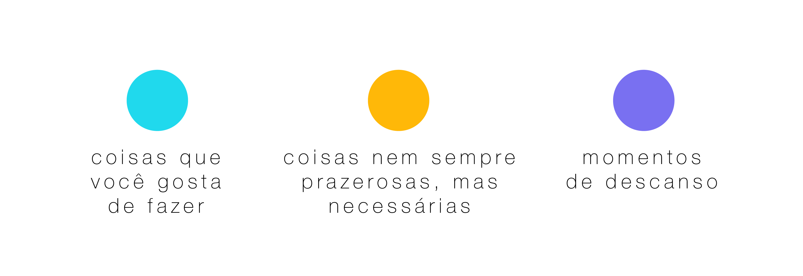

<html>
   <body>
      <article id="4f38cd59-7ab8-4b58-885a-7542a3154d7f" class="page sans">
         <header>
            <h1 class="page-title">Equilibrium</h1>
         </header>
         

            

               

                  <figure id="f32fc24b-6dbd-4d29-8f9b-9e3841b77bbf" class="image"></figure>
               

               

                  <h2 id="fd5ac269-d21a-4bd8-a1c5-4e34614f9821" class="">The Project</h2>
                  
O Equilibrium é um Playground que tem o objetivo de trazer reflexões sobre a nossa vida, tempo e cotidiano a partir da abstração deste contexto em um jogo.

                  

               

            

            <h2 id="a9567f7b-fe83-49ea-8592-46f01b254454" class="">The Idea </h2>
            
A ideia pro Playground surgiu da vontade de compartilhar estas reflexões sobre o que é mais importante na nossa vida e como, muitas vezes, estamos deixando isso de lado gastando a maior parte do nosso tempo com outras coisas. Sim, eu sei que isso muitas vezes isso não está sob nosso controle, eu mesma tenho que fazer mil coisas ao mesmo tempo e quase não consigo ter momentos de lazer, por exemplo. Mas acredito que quando nos damos conta disso, já estamos dando um passo na direção de melhorar essa realidade e tentar aproveitar a vida ao máximo.

            
É com este objetivo que o Equilibrium surge e tenta passar a reflexão a partir de um jogo onde você tem que equilibrar o preenchimento de tanques com bolinhas de suas respectivas cores, que significam 3 tipos de coisas diferentes que temos no nosso dia a dia, correndo contra o tempo da nossa rotina e percebendo os impactos que cada tipo de ação proporciona.

            <figure id="a997ce71-3ecc-4dfb-9de2-854272fb6c10" class="image"></a></figure>
            <h2 id="b5920a54-daa2-45a2-a308-bccf3a4a81b3" class="">Hands-on Equilibrium</h2>
            <figure id="a1947fdf-d030-46ad-8319-856f8619c3fb">
               

            </figure>
            

               

                  <h2 id="e485db05-e66f-433c-a88d-2bb870099543" class="">Main Challenges</h2>
                  
O grande desafio do projeto foi definir a mecânica do jogo e desenvolver a ideia no código, tendo pouquíssimo conhecimento prévio nesta área e com apenas 2 semanas de prazo. Mas com muita pesquisa, ajuda de colegas e mentores cheguei a este resultado que está longe de perfeito, mas muito satisfatório pra mim e melhor do que eu achei que seria possível.

               

            

            <h2 id="3108f94f-0fd4-4f69-936f-92044106493f" class="">Results</h2>
            
No vídeo encontram-se algumas considerações sobre o processo e insights de melhorias capturados nos testes de usabilidade.

            <figure id="31fefced-7a86-4aef-bee6-51ddba473a45">
               

            </figure>
            

            

         

      </article>
   </body>
</html>
